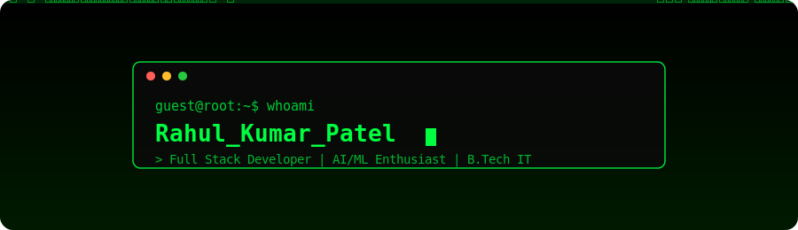

  

 

 

  

 

## 👨‍💻 About Me

- 🎓 Pursuing **B.Tech in Information Technology**
- 💻 Passionate about building **scalable, real-world applications**
- 🚀 Exploring **Full Stack Development, AI/ML & Cloud Computing**
- 🌱 Strengthening my **Data Structures & Algorithms** and problem-solving skills
- 🤝 Open to **Open Source Collaboration**
- 📚 Always learning new technologies
- ⚡ Fun fact: **Code • Learn • Build • Repeat**

 

## 🛠️ Tech Stack

**Languages**

**Frontend**

**Backend & Databases**

**Tools & Platforms**

 

## 📊 GitHub Stats

 

## 🐍 Contribution Snake

<picture>
  <source media="(prefers-color-scheme: dark)" srcset="https://raw.githubusercontent.com/Rahulpatel73/Rahulpatel73/output/github-contribution-grid-snake-dark.svg" />
  <source media="(prefers-color-scheme: light)" srcset="https://raw.githubusercontent.com/Rahulpatel73/Rahulpatel73/output/github-contribution-grid-snake.svg" />
  
</picture>

> ⚙️ **Setup note:** ye snake tabhi dikhega jab tumhare `Rahulpatel73/Rahulpatel73` repo mein neeche diya gaya workflow file add ho aur ek baar run ho jaaye (Actions tab se manually trigger kar sakte ho, ya push par khud chalega).

 

## 🌐 Connect With Me

 

### 💡 "The best way to predict the future is to build it." 🚀

## Hi there 👋

<!--
**Rahulpatel73/Rahulpatel73** is a ✨ _special_ ✨ repository because its `README.md` (this file) appears on your GitHub profile.

Here are some ideas to get you started:

- 🔭 I’m currently working on ...
- 🌱 I’m currently learning ...
- 👯 I’m looking to collaborate on ...
- 🤔 I’m looking for help with ...
- 💬 Ask me about ...
- 📫 How to reach me: ...
- 😄 Pronouns: ...
- ⚡ Fun fact: ...
-->
